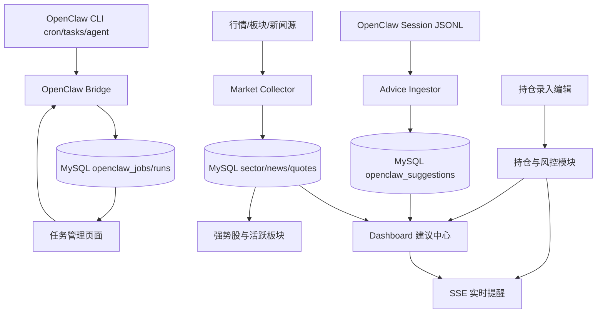

# 架构总览

## 模块

- `Panel Web`：页面展示 + API
- `OpenClaw Bridge`：cron 命令封装与缓存同步
- `Advice Ingestor`：增量解析 JSONL 建议
- `Market Collector`：板块与新闻采集
- `Scheduler`：交易时段高频，非交易时段低频
- `Risk Engine`：组合风险计算与快照
- `Audit`：关键操作审计日志
